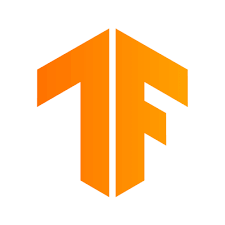
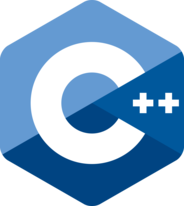

[](http://docs.leggedrobotics.com/tensorflow/)
[](https://ci.leggedrobotics.com/job/github_leggedrobotics/job/tensorflow-cpp/job/master/)

# TensorFlow CMake

This repository provides pre-built TensorFlow for C/C++ (headers + libraries) and CMake.

**Maintainer:** Vassilios Tsounis  
**Affiliation:** Robotic Systems Lab, ETH Zurich  
**Contact:** tsounisv@ethz.ch

## Overview

This repository provides TensorFlow libraries with the following specifications:  

  - Provided versions: `1.13.2` (Default)
  - Supports Ubuntu 18.04 LTS (GCC >=7.4).  
  - Provides variants for CPU-only and Nvidia GPU respectively.  
  - All variants are built with full CPU optimizations available for `amd64` architectures.  
  - GPU variants are built to support compute capabilities: `5.0`, `6.1`, `7.0`, `7.2`, `7.5`  

**NOTE:** This repository does not include or bundle the source TensorFlow [repository](https://github.com/tensorflow/tensorflow).

## Install

First clone this repository:
```bash
git clone https://bitbucket.org/leggedrobotics/tensorflow.git
```

### Eigen

To install the special version of Eigen requried by TensorFlow which we also bundle in this repository:
```bash
cd tensorflow/eigen
mkdir build && cd build
cmake -DCMAKE_INSTALL_PREFIX=~/.local -DCMAKE_BUILD_TYPE=Release ..
make install -j
```
**NOTE:** We recommend installing to `~/.local` in order to prevent conflicts with other version of Eigen which may be installed via `apt`. Eigen exports its package during the build step, so CMake will default to finding the one we just installed unless a `HINT` is used or `CMAKE_PREFIX_PATH` is set to another location.  

### TensorFlow

These are the options for using the TensorFlow CMake package:

**Option 1 (Recommended):** Installing into the (local) file system
```bash
cd tensorflow/tensorflow
mkdir build && cd build
cmake -DCMAKE_INSTALL_PREFIX=~/.local -DCMAKE_BUILD_TYPE=Release ..
make install -j
```
**NOTE:** The CMake will download the pre-built headers and binaries at build time and should only happen on the first run.

**Option 2 (Advanced):** Create symbolic link to your target workspace directory:
```bash
ln -s /<SOURCE-PATH>/tensorflow/tensorflow <TARGET-PATH>/
```

For example, when including as part of larger CMake build or in a Catkin workspace
```bash
ln -s ~/git/tensorflow/tensorflow ~/catkin_ws/src/
```

## Use

TensorFlow CMake can be included into other projects either using the `find_package` command:
```CMake
...
find_package(TensorFlow CONFIG REQUIRED)
...
```

or alternatively included directly into other projects using the `add_subdirectory` command
```CMake
...
add_subdirectory(/<SOURCE-PATH>/tensorflow/tensorflow)
...
```
**NOTE:** By default the CMake package will select the GPU-enabled variant of a given library version and defining/setting the `TF_CPU_ONLY` option variable reverts to the CPU-only variant.

User targets such as executables and libraries can now include the `TensorFlow::TensorFlow` CMake target using the `target_link_libraries` command.
```CMake
add_executable(tf_hello src/main.cpp)
target_link_libraries(tf_hello PUBLIC TensorFlow::TensorFlow)
target_compile_features(tf_hello PRIVATE cxx_std_14)
```
**NOTE:** For more information on using CMake targets please refer to this excellent [article](https://pabloariasal.github.io/2018/02/19/its-time-to-do-cmake-right/).

A complete [example](https://bitbucket.org/leggedrobotics/tensorflow/src/master/tensorflow/examples/) is included in this repository to provide boilerplate CMake for developers of dependent projects and packages.

## Customize

If a specialized build of TensorFlow (e.g. different verion of CUDA, NVIDIA Compute Capability, AVX etc) is required, then the following steps can be taken:  
1. Follow the standard [instructions](https://www.tensorflow.org/install/source) for installing system dependencies.  
**NOTE:** For GPU-enabled systems, additional [steps](https://www.tensorflow.org/install/gpu) need to be taken.  
2. View and/or modify our utility [script](https://bitbucket.org/leggedrobotics/tensorflow/src/master/tensorflow/bin/build.sh) for step-by-step instructions for building, extracting and packaging all headers and libraries generated by Bazel from building TensorFlow.  
3. Set the `TENSORFLOW_ROOT` variable with the name of the resulting directory:
```bash
cmake -DTENSORFLOW_ROOT=~/.tensorflow/lib -DCMAKE_INSTALL_PREFIX=~/.local -DCMAKE_BUILD_TYPE=Release ..
```

## License

[Apache License 2.0](LICENSE)
