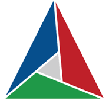

[](http://docs.leggedrobotics.com/tensorflow/)
[](https://ci.leggedrobotics.com/job/github_leggedrobotics/job/tensorflow-cpp/job/master/)

# TensorFlow CMake

This repository provides pre-built TensorFlow for C/C++ (headers + libraries) and CMake.

**Maintainer:** Vassilios Tsounis  
**Affiliation:** Robotic Systems Lab, ETH Zurich  
**Contact:** tsounisv@ethz.ch

## Overview

This repository provides TensorFlow libraries with the following specifications:  

  - Provided versions: `1.15.2` (Default) and `1.13.2`  
  - Supported for Ubuntu 18.04 LTS.  
  - Built with GCC>=7.5.  
  - Built with support for C++14.  
  - Provides variants for CPU-only and Nvidia GPU respectively.  
  - All variants are built with full CPU optimizations available for `amd64` architectures.  
  - GPU variants are built to support compute capabilities: `5.0`, `6.1`, `7.0`, `7.2`, `7.5`  

**NOTE:** This repository does not include the [TensorFlow](https://github.com/tensorflow/tensorflow) source files.

**NOTE:** As each pre-built distribution of TensorFlow is quite large (~1GB), the `tensorflow/CMakeLists.txt` CMake script will automatically download and unpack the archive the first time the package is built.

A complete CMake [example](https://github.com/leggedrobotics/tensorflow-cpp/tree/master/examples) example is provided for demonstrating how to write dependent packages.

Moreover, we provide additional scripts and tooling for:  

* Downloading, patching and installing [Eigen](http://eigen.tuxfamily.org/).
* Building `tensorflow` from source and extracting all library binaries and headers.


## Install

First clone this repository:
```bash
git clone https://github.com/leggedrobotics/tensorflow-cpp.git
```
or if using SSH:
```bash
git clone git@github.com:leggedrobotics/tensorflow-cpp.git
```

### Eigen

Each distribution of `tensorflow>=r1.13` requires a special patched version of the [Eigen](http://eigen.tuxfamily.org/) header-only library. As of `v0.2.0` of this repository, the aforementioned patched header files of Eigen are already included in the the headers downloaded by `tensorflow/CMakeLists.txt`. However, in certain cases, code in some package `A` using `tensorflow-cpp` might interface with some other code in an external package `B` that also uses Eigen.  Thus, in order to ensure that `A` and `B` work together properly, we must build both packages using the same version of Eigen.

For such cases, we provide an `bash` script in `tensorflow-cpp/eigen/install.sh`.  

To download, unpack and patch Eigen:
```commandline
cd tensorflow-cpp/eigen
install.sh
```
To additionally build and install Eigen, the `--run-cmake` argument can be used:
```commandline
cd tensorflow-cpp/eigen
install.sh --run-cmake
```

**NOTE:** We recommend installing to `~/.local` in order to prevent conflicts with other version of Eigen which may be installed via `apt`. Eigen exports its package during the build step, so CMake will default to finding the one we just installed unless a `HINT` is used or `CMAKE_PREFIX_PATH` is set to another location.  

### TensorFlow

These are the options for using the TensorFlow CMake package:

**Option 1 (Recommended):** Installing into the (local) file system
```bash
cd tensorflow/tensorflow
mkdir build && cd build
cmake -DCMAKE_INSTALL_PREFIX=~/.local -DCMAKE_BUILD_TYPE=Release ..
make install -j
```
**NOTE:** The CMake will download the pre-built headers and binaries at build time and should only happen on the first run.

**Option 2 (Advanced):** Create symbolic link to your target workspace directory:
```bash
ln -s /<SOURCE-PATH>/tensorflow/tensorflow <TARGET-PATH>/
```

For example, when including as part of larger CMake build or in a Catkin workspace
```bash
ln -s ~/git/tensorflow/tensorflow ~/catkin_ws/src/
```

## Use

TensorFlow CMake can be included in other projects either using the `find_package` command:
```CMake
...
find_package(TensorFlow CONFIG REQUIRED)
...
```

or alternatively included directly into other projects using the `add_subdirectory` command
```CMake
...
add_subdirectory(/<SOURCE-PATH>/tensorflow/tensorflow)
...
```
**NOTE:** By default the CMake package will select the CPU-only variant of a given library version and defining/setting the `TF_USE_GPU` option variable reverts to the GPU-enabled variant.

User targets such as executables and libraries can now include the `TensorFlow::TensorFlow` CMake target using the `target_link_libraries` command.
```CMake
add_executable(tf_hello src/main.cpp)
target_link_libraries(tf_hello PUBLIC TensorFlow::TensorFlow)
target_compile_features(tf_hello PRIVATE cxx_std_14)
```
**NOTE:** For more information on using CMake targets please refer to this excellent [article](https://pabloariasal.github.io/2018/02/19/its-time-to-do-cmake-right/).

Please refer to our complete [example](https://github.com/leggedrobotics/tensorflow-cpp/tree/master/examples) for details.

## Customize

If a specialized build of TensorFlow (e.g. different verion of CUDA, NVIDIA Compute Capability, AVX etc) is required, then the following steps can be taken:  
1. Follow the standard [instructions](https://www.tensorflow.org/install/source) for installing system dependencies.  
**NOTE:** For GPU-enabled systems, additional [steps](https://www.tensorflow.org/install/gpu) need to be taken.  
2. View and/or modify our utility [script](https://github.com/leggedrobotics/tensorflow-cpp/blob/master/tensorflow/bin/build.sh) for step-by-step instructions for building, extracting and packaging all headers and libraries generated by Bazel from building TensorFlow.  
3. Set the `TENSORFLOW_ROOT` variable with the name of the resulting directory:
```bash
cmake -DTENSORFLOW_ROOT=~/.tensorflow/lib -DCMAKE_INSTALL_PREFIX=~/.local -DCMAKE_BUILD_TYPE=Release ..
```

## Issues

If experiencing any issues please first take a look at our [ISSUES.md](https://github.com/leggedrobotics/tensorflow-cpp/blob/master/ISSUES.md) file. If you are experiencing something we have not accounted for please create a new repository issue.

## License

[Apache License 2.0](LICENSE)
